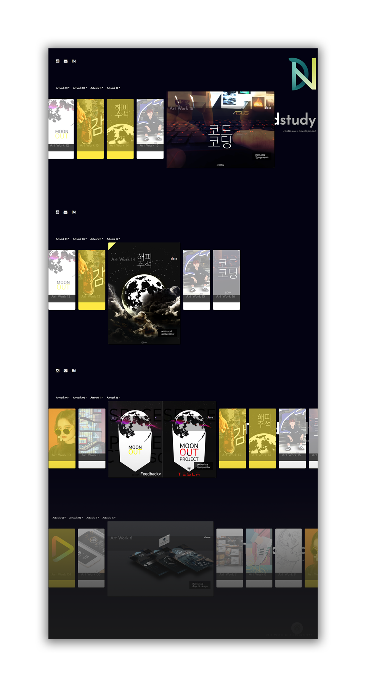

  

# portfolio-gallery

 

스타벅스 리디자인 | japan Starbucks webdesign remake

## Content

### 제작할 사이트 컨셉

연습으로 했던 가로 스크롤 갤러리 페이지를 꼭 활용하고 싶었다. 내가 하나 하나하나 손으로 그리고 무언가를 만드는 걸 차곡차곡 쌓아 놓을 수 있는 페이지를 만들어야 했는데 콘셉트가 딱 맞았다.

### 코딩으로 구현하면서 제일 어려웠던 부분

갤러리의 사진을 클릭하면 자세히 보는 것을 A4 크기의 세로형 가로형을 나누어 보여줄 수 있게 구현하는 것에서 제일 어려웠고 힘들었다. 그리고 지속해서 콘텐츠를 추가해야 되는 웹을 만들어야 했기 때문에 HTML에만 등록하면 바로바로 추가 될 수 있게 구현하는데 애를 먹었다.

### 앞으로 유지보수를 어떻게할 것인지?

새로운 결과물을 HTML로만 추가하면 되게끔 쉽게 추가 할 수 있게 구현하였다. 앞으로 피드백을 받고 어느 부분이 수정되면 좋을지 보면서 수정하면 될 거 같다.

### 어떤 발전을 이룰 것 인지?

계획으로는 드래그 jQuery를 하드코딩해서 직접 만들어내는것이 목표이다.

### 메인이 되는 카피라이트 문구는?

`Trendstudy`

트렌드를 계속 공부하고 만들어나갈 것이다.

### 컨텐츠는 무엇무엇을 담을 것인가?

트렌드 공부를위해 계속 만들어보는 작업물들을 주된 콘텐츠로 담을 것이다.

### 레이아웃은 어떤 형태로 진행

원페이지 고정 레이아웃

## 피드백, 보완점

- [#3](https://github.com/Hansanghyeon/portfolio-gallery/issues/3)
- [#2](https://github.com/Hansanghyeon/portfolio-gallery/issues/2)
- [#1](https://github.com/Hansanghyeon/portfolio-gallery/issues/1)